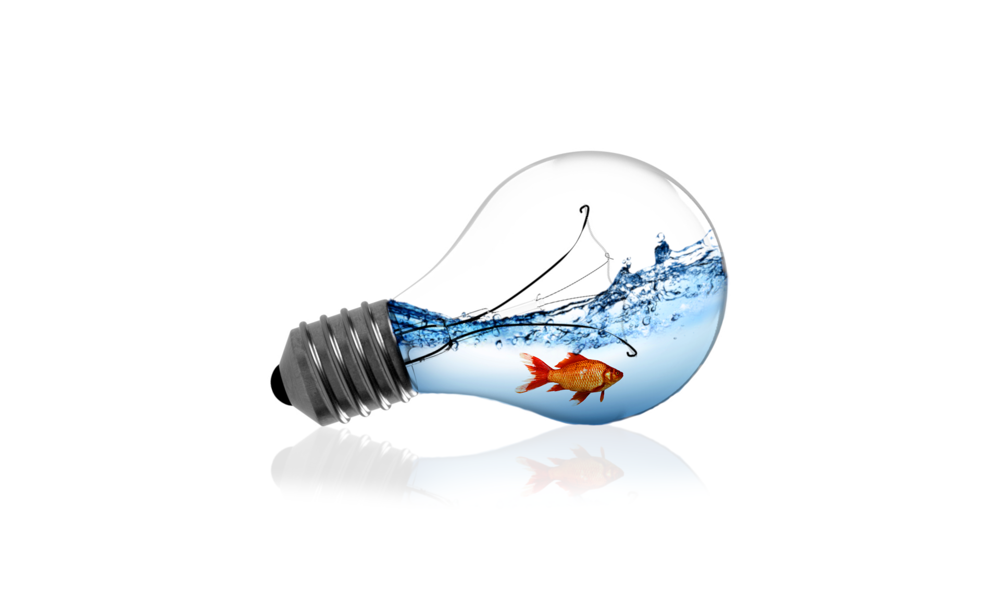

<!DOCTYPE html>
<html lang="en">

<head>

  <meta charset="utf-8">
  <meta name="viewport" content="width=device-width, initial-scale=1, shrink-to-fit=no">
  <meta name="description" content="">
  <meta name="author" content="">

  <title>Blog Home - Start Bootstrap Template</title>

  <!-- Bootstrap core CSS -->
  <link href="vendor/bootstrap/css/bootstrap.min.css" rel="stylesheet">

  <!-- Custom styles for this template -->
  <link href="css/blog-home.css" rel="stylesheet">

</head>

<body>

  <!-- Navigation -->
  <nav class="navbar navbar-expand-lg navbar-dark bg-dark fixed-top">
    

      <a class="navbar-brand" href="#">FABLAB GIMP</a>
      <button class="navbar-toggler" type="button" data-toggle="collapse" data-target="#navbarResponsive" aria-controls="navbarResponsive" aria-expanded="false" aria-label="Toggle navigation">
        
      </button>
      

        <ul class="navbar-nav ml-auto">
          <li class="nav-item active">
            <a class="nav-link" href="#">Home
              (current)
            </a>
          </li>
          <li class="nav-item">
            <a class="nav-link" href="#">About</a>
          </li>
          <li class="nav-item">
            <a class="nav-link" href="#">Services</a>
          </li>
          <li class="nav-item">
            <a class="nav-link" href="#">Contact</a>
          </li>
        </ul>
      

    

  </nav>

  <!-- Page Content -->
  

    

      <!-- Blog Entries Column -->
      

        <h1 class="my-4">FABLAB GIMP
          <small>Lesson Documentation</small>
        </h1>

        <!-- Blog Post -->
		<!-- -------------------LESSON 1--------------------------- -->
        

          
          

            <h2 class="card-title">Lesson 1</h2>
            
Lorem ipsum dolor sit amet, consectetur adipisicing elit. Reiciendis aliquid atque, nulla? Quos cum ex quis soluta, a laboriosam. Dicta expedita corporis animi vero voluptate voluptatibus possimus, veniam magni quis!
			

            <a href="#" class="btn btn-primary">Read More &rarr;</a>
          

          

            Posted on May 12, 2017 by
            <a href="#">Miquel Altadill</a>
          

        

        <!-- Blog Post -->
		  <!-- -------------------LESSON 2--------------------------- -->
        

          
          

            <h2 class="card-title">Lesson 2</h2>
            
En esta clase realizamos el efecto de un pez dentro de una bombilla tal como podemos ver en la imagen. Para realizar esto aplicamos una capa de agua y la recortamos al interior inclinandola para darle efecto de movimiento. Despues añadimos un pez a partir de una imagen sin fondo y le dimos mas contraste para resaltarlo.

            <a href="https://www.youtube.com/watch?v=DUAb6-nJto4" class="btn btn-primary">Read More &rarr;</a>
          

          

            Posted on May 19, 2019 by
            <a href="#">Miquel Altadill</a>
          

        

        <!-- Blog Post -->
		<!-- -------------------LESSON 3--------------------------- -->
        

          
          

            <h2 class="card-title">Lesson 3</h2>
            
Lorem ipsum dolor sit amet, consectetur adipisicing elit. Reiciendis aliquid atque, nulla? Quos cum ex quis soluta, a laboriosam. Dicta expedita corporis animi vero voluptate voluptatibus possimus, veniam magni quis!

            <a href="https://www.youtube.com/watch?v=VADHdoPwKtw&t=747s" class="btn btn-primary">Read More &rarr;</a>
          

          

            Posted on May 26, 2019 by
            <a href="#">Miquel Altadill</a>
          

        

		  
		<!-- -------------------FUTURES MILLORES DE LA WEB--------------------------- -->
        <!-- Pagination -->
		
        <ul class="pagination justify-content-center mb-4">
          <li class="page-item">
            <a class="page-link" href="#">&larr; Older</a>
          </li>
          <li class="page-item disabled">
            <a class="page-link" href="#">Newer &rarr;</a>
          </li>
        </ul>
		 <!-- --------------------------------------------------------------------------- -->
      

      <!------------------------ BARRA LATERAL  -------------------------------------------- -->
      

       

        <!-- Categories Widget -->
        

          <h5 class="card-header">Categories</h5>
          

            

              

                <ul class="list-unstyled mb-0">
                  <li>
                    <a href="#">Edición</a>
                  </li>
                  <li>
                    <a href="#">Logos</a>
                  </li>
               </ul>
              

              

                <ul class="list-unstyled mb-0">
                  <li>
                    <a href="#">Recortes</a>
                  </li>
                  <li>
                    <a href="#">Miniaturas</a>
                  </li>                  
                </ul>
              

            

          

        

        <!-- Side Widget -->
        

          <h5 class="card-header">Información General</h5>
          
            
			Esta página web contiene la documentación de las lecciones aprendidas utilizando el programa de edición de imagen GIMP. Nos ayudará a recordar cómo se crean páginas web y también a tener una recopilación de los proyectos realizados. 
          

        

      

		
	<!-- --------------------------------------------------------------------------- -->

    

    <!-- /.row -->

  

  <!-- /.container -->

  <!-- Footer -->
  <footer class="py-5 bg-dark">
    

      
Copyright &copy; FABLAB Gimp

    

    <!-- /.container -->
  </footer>

  <!-- Bootstrap core JavaScript -->
  
  

</body>

</html>
