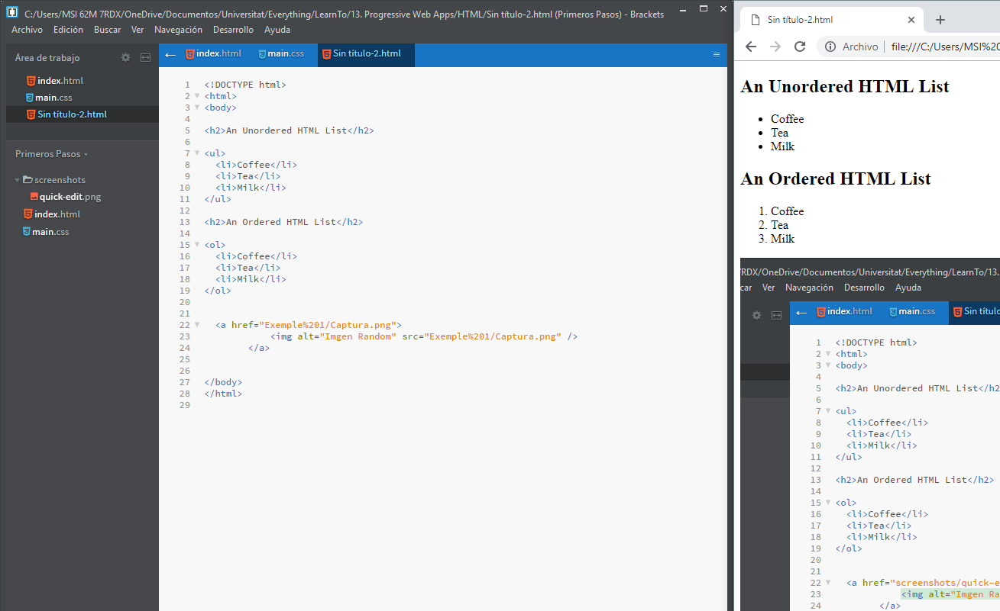

# Maikuelet.github.io

<!DOCTYPE html>
<html>
<body style="background-color:powderblue;">  <!-- Define Back color as a bdy attribute-->
    
<h2>Pàgina Exemple</h2>

<h2>An Unordered HTML List</h2>

<ul>                        <!-- Llista en punts --> 
  <li>Coffee</li>
  <li>Tea</li>
  <li>Milk</li>
</ul>  

<h2>An Ordered HTML List</h2> 

<ol>                        <!-- Llista numerada -->
  <li>Coffee</li>           
  <li>Tea</li>
  <li>Milk</li>
</ol> 

    
<a href="https://www.w3schools.com/HTML/HTML_EXAMPLES.ASP">Tutorial link</a>

<button>    <!-- Mateix link que abans pero en boto --> 
    <a href="https://www.w3schools.com/HTML/HTML_EXAMPLES.ASP">Tutorial link</a>   
</button>

Salt de linia

<!-- Posar Salt de linia -->
<a href="https://www.w3schools.com/HTML/HTML_EXAMPLES.ASP">Tutorial link</a>

     <!-- Salt de linia -->
<button>    <!-- Mateix link que abans pero en boto --> 
    <a href="https://www.w3schools.com/HTML/HTML_EXAMPLES.ASP">Tutorial link</a>   
</button>
   
<h2> Imatge amb Atributs</h2>
<a href="Example.PNG">
       <!-- img Attribute  for images-->
    <!-- alt= text alternatiu si no carga im        src= filename or image source      width/heigth = for dimensions             -->  
</a>
    

   <!-- Per marcar separacions -->
<h2>Paragrafs</h2>

  <!-- Sempre cometes en els atributs -->
This is a paragraph.Posa el ratoli a sobre meu            <!-- Here, a title attribute is added to the 
 element. The value of the title attribute will be displayed as a tooltip when you mouse over the paragraph--> 

This is a paragraph with line breaks.

    
<pre>
  My Bonnie        lies over the ocean.

  My Bonnie lies over the sea.

  My Bonnie lies over the ocean.

  Oh, bring back my Bonnie to me.
</pre>
    
<h1>ESTILOS</h1>
<h2>COLOR TEXTO</h2>
<h4 style="color:blue;">This is a heading</h4>    <!-- Sol usar tituls per tituls -->

This is a paragraph.
 

<h2> TAMAÑO LETRA</h2>
<h4 style="font-size:300%;">This is a heading</h4>

This is a paragraph.

    
<h2> COMBINACION</h2>
<h4 style="font-size:300%;" style="color:blue">This is a heading</h4>

This is a paragraph.
  
    
<h1 style="text-align:center;">Centered Heading</h1>

Centered paragraph.

    
<h1 style="font-family:verdana;">This is a heading</h1>

This is a paragraph.

    
<h1 style="background-color:DodgerBlue;">Hello World</h1>

Lorem ipsum...

    
    
<h1>FORMATO</h1>
<b>This text is bold</b>    
<strong>This text is strong</strong>
<i>This text is italic</i>
<em>This text is emphasized</em>
<h2>HTML <small>Small</small> Formatting</h2>

My favorite color is <del>blue</del> red.

My favorite <ins>color</ins> is red.

This is subscripted text.

This is superscripted text.

    

</body>
</html>

